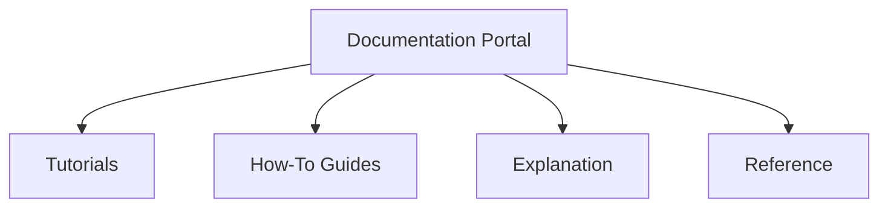

# Helix — AI-Native Governance Operating System: Project Charter (HELIX-SPEC-000)

## 1. Executive Summary
Helix is an AI-Native Governance Operating System designed to resolve the systemic friction between citizens and public institutions. Far from being a simple ticketing system, a chatbot, or a passive analytical dashboard, Helix serves as an active, event-driven orchestration platform. It transforms highly unstructured, multilingual citizen inputs into structured, explainable, and evidence-backed decision intelligence.

By integrating modern Large Language Model (LLM) reasoning with transactional systems of record, Helix provides public representatives (Members of Parliament, MLAs), local administrators, and municipal bodies with an institutional memory and a unified workflow interface. Helix bridges the operational gap between grassroots citizen grievances and high-level policy making, ensuring safety, auditability, and absolute human control at every stage.

---

## 2. Why Helix Exists
Modern public governance systems are severely fragmented, operating on legacy paradigms that fail to handle the volume and complexity of contemporary community needs:
* **Unstructured and Multilingual Input Bottlenecks:** Citizen grievances arrive via disparate channels—WhatsApp, voice notes, physical letters, and portal submissions—often in local dialects or mixed scripts. Public offices lack the personnel to parse, classify, and extract actionable data from these inputs at scale.
* **Severe Administrative Fatigue:** Municipal and constituency administrators are overwhelmed by manual triage. They spend major operational cycles searching for policy documents, matching problems with existing welfare schemes, and identifying duplicate complaints instead of resolving the root issues.
* **Lack of Institutional Memory:** Public offices experience high staff turnover. Critical knowledge about community grievances, ongoing regional resolutions, and localized infrastructure issues lives in paper files or the heads of individuals, disappearing when personnel change.
* **Opaque Decision-Making:** Existing automated tools act as black boxes. They fail to explain *why* an issue was prioritized or *how* a specific scheme was recommended, leading to distrust among citizens and administrative friction among officials.
* **Fragile Legacy Software:** Current government IT portals are monolithic, highly fragile, and difficult to customize or extend, making it nearly impossible to integrate AI capabilities safely and rapidly.

Helix exists to rebuild this machinery from the ground up, deploying a secure, scalable, and explainable AI-native orchestration engine that serves as the central brain of public administration offices.

---

## 3. Vision Statement
Helix aims to become a reusable governance platform that can be adapted by public institutions with different administrative structures while preserving local policy, language, and regulatory requirements.

---

## 4. Mission Statement
Our mission is to deploy an adaptable, secure, and production-ready AI-native governance operating system. Helix will enable administrators to ingest heterogeneous community inputs, automatically synthesize them into actionable insights, link them to policy sources, and orchestrate compliant responses with zero operational friction.

---

## 5. Long-Term Vision (5–10 Years)
In the next decade, Helix will evolve into a globally adopted public utility. Its modular plugin architecture will allow any developer, municipality, or state agency to build custom integrations and schema extensions. Helix will serve as a federated network of governance nodes, facilitating cross-jurisdictional collaboration, predicting localized infrastructure failures, and dynamically aligning government budgets with real-time community needs, all while maintaining rigorous local privacy and sovereignty bounds.

---

## 6. Non-Goals
To prevent scope creep and maintain architectural boundaries, Helix will **NOT** perform the following actions:
* **Replace Members of Parliament (MPs) or MLAs:** Helix does not assume political representation or representative duties.
* **Replace Public Officers or Administrators:** The system does not possess authority to approve actions or bypass executive workflows.
* **Make Public Policy:** Helix is an execution and analysis system; it does not author or legislate legal or policy frameworks.
* **Allocate Budgets autonomously:** The system does not make financial allocations or commit public funds without explicit human administrative approval.
* **Replace Enterprise Resource Planning (ERP) or Core Systems of Record:** Helix is an orchestration and interface layer; it integrates with, but does not replace, established transactional financial or civic databases.
* **Replace Human Governance:** Every action must reside under human administrative control.
* **Make Autonomous Political Decisions:** The system is politically neutral and does not weigh in on policy arguments or legislative directions.

---

## 7. System Constitution
Helix is governed by a strict set of architectural rules and cultural laws. These are defined in the separate constitution document: [00-helix-constitution.md](file:///home/harsh/Desktop/CodeNova/Helix/docs/culture/00-helix-constitution.md).

Every contributor must review the constitution to understand the twelve core constraints (e.g., Citizens never learn workflows, Explainability by default, Evidence before intelligence, Production quality from day one).

---

## 8. Architectural Characteristics
We prioritize the following architectural attributes when designing, extending, or deploying services within the Helix platform:

| Characteristic | Priority | Description |
| :--- | :---: | :--- |
| **Explainability** | ★★★★★ | All AI outputs, priority scores, and classifications must have auditable reasoning paths. |
| **Security & Privacy** | ★★★★★ | Strict RBAC, transport and rest encryption, database-level PII hashing. |
| **Accessibility** | ★★★★★ | Full compliance with WCAG 2.2 AAA guidelines to ensure equitable civic access. |
| **Maintainability** | ★★★★★ | Strict separation of concerns, documentation-first code updates, and clean test suites. |
| **Extensibility** | ★★★★★ | Modular plugin-first framework for LLMs, channels, and search engines. |
| **Latency** | ★★★★★ | Fast response times (Grienvance ingestion <5s, dashboard queries <2s). |
| **Availability** | ★★★★★ | Transactional resilience and high uptime (Target 99.9% availability). |
| **Scalability** | ★★★★★ | Event-driven microservices containerized for horizontal scaling. |
| **Offline Support** | ★★★★☆ | State caching and offline storage capabilities on low-connectivity mobile nodes. |
| **Vendor Neutrality** | ★★★★☆ | Agnostic interfaces for cloud, LLM, and database providers to support self-hosting. |

---

## 9. Risk Philosophy
Helix structures its decision-making, exception handling, and error routing around a strict risk hierarchy:
$$\text{Correctness} > \text{Availability} > \text{Convenience}$$

* **Verification over Speculation:** If the AI engine is uncertain of a categorization or recommendation (falls below the confidence threshold), or if there is insufficient evidence to support a query, the system **must not attempt an answer**. It must fail-safe, alert the user, and route the issue to manual processing.
* **Security over Convenience:** User sessions, cryptographic approvals, and variable parameters must use strict security checks even if they increase operational steps for the administrator.

---

## 10. Terminology

* **Citizen:** The public user submitting issues, feedback, or requests to the governance system.
* **Issue:** A structured representation of a citizen's grievance, query, or report (e.g., a broken street light or a scheme application).
* **Asset:** A physical or digital resource owned or managed by the public office (e.g., a water pump, a budget ledger, or a local policy document).
* **Project:** An organized, multi-step action plan created to resolve one or more issues (e.g., a road repair scheme).
* **Recommendation:** An AI-generated proposal containing suggested resolutions, matching welfare schemes, or categorization options.
* **Evidence:** The set of source facts, policy clauses, and geolocation logs used to substantiate an AI recommendation.
* **Outcome:** The measurable real-world result of resolving an issue or deploying a project.
* **Decision:** A cryptographically signed human approval that resolves an issue or initiates a project.
* **Plugin:** An isolated module that implements a defined interface to extend Helix's capabilities (e.g., a WhatsApp message receiver).
* **Agent:** An autonomous LLM-driven routine that executes specific tools to perform classifications, searches, or document synthesis under supervision.

---

## 11. System Constraints
The design of Helix is bound by the following real-world limitations:
* **Low Connectivity & Internet Intermittency:** The system must function gracefully over slow 2G/3G connections, caching state locally on mobile clients and utilizing light payload formats.
* **Low Literacy Levels:** Ingest interfaces must support voice messages, image submissions, and icon-driven workflows.
* **Multilingualism & Dialects:** Ingestion must parse languages written in local scripts (e.g., Devanagari, Tamil) as well as phonetically transliterated Roman text (e.g., Hinglish).
* **Limited Local Hardware:** Client dashboards for public officers must run on older desktop systems or entry-level mobile devices.
* **Government Procurement Policies:** Architecture must avoid lock-in to proprietary cloud APIs, supporting self-hosted, open-source models, and on-premise infrastructure.

---

## 12. Performance Targets
To guarantee usability in high-stress operational environments:
* **Citizen Message Triage Latency:** Incoming citizen inputs must be parsed, translated, classified, and stored in the database in less than **5 seconds** from receipt.
* **Administrative Dashboard Refresh Latency:** Data queries, analytical filters, and search indexing lookups must load in less than **2 seconds**.
* **High Availability:** Core ingestion endpoints must maintain a target uptime of **99.9%** to prevent dropped community communications.
* **RAG Retrieval Precision:** The knowledge retrieval pipeline must score above **95%** in relevance evaluation benchmarks before updates are deployed.

---

## 13. Governance Ethics
Helix implements rigorous ethical frameworks appropriate for civic software:
* **Political Neutrality:** AI search, classification, and drafting systems must remain objective. The database must not index biased political messaging or prioritize issues based on political affiliation.
* **Transparency:** Citizens must have access to a public portal to track the status of their issues, the policy justification behind decisions, and the metrics driving priorities.
* **Privacy by Default:** PII (Personally Identifiable Information) must be encrypted at the database level and masked during processing by LLM agents.
* **Bias Mitigation:** Automated prioritization algorithms must be audited to ensure they do not systematically under-serve specific neighborhoods or demographic groups.
* **Accessibility Compliance:** Core administrative portals must conform strictly to WCAG 2.2 AAA standards.

---

## 14. Success Principles
Our operational rules dictate that when system thresholds are crossed, Helix degrades gracefully:
* **Rule 1 (Transparency Gate):** If the AI engine cannot explain its reasoning or cite a source for a draft recommendation, it must fail-open and present a blank workspace to the administrator.
* **Rule 2 (Confidence Gate):** If the model confidence score for an automated classification falls below **0.80**, the system bypasses auto-drafting and routes the issue straight to the manual triaging queue.
* **Rule 3 (Evidence Gate):** If a retrieved context query contains insufficient evidence to answer a citizen's policy question, the system is prohibited from answering or speculating; it must report the lack of information.

---

## 15. Core Product Principles

### 15.1. Zero Friction
Citizen engagement must occur where the citizens already are. Helix interfaces natively with ubiquitous messaging protocols (e.g., WhatsApp, Telegram, SMS, voice channels) and automatically handles language localization, dialect detection, and media translation. The citizen is never forced to download specialized apps or learn complex portal interfaces.

### 15.2. AI Works Silently
AI should never act as a visible front-facing gatekeeper. In Helix, LLMs work silently in the background—classifying incoming data, drafting responses, cross-referencing policy, and extracting entities. The primary interface for both citizens and administrators remains clean, human-driven, and utility-focused.

### 15.3. Humans Stay in Control
No automated agent is authorized to commit public resources, dispatch personnel, or send official communications autonomously. Helix enforces a strict Human-in-the-Loop (HITL) gate for every outward-facing action. AI acts as an accelerator, but accountability resides solely with the authenticated human operator.

### 15.4. Explainability by Default
Every recommendation, classification, or draft generated by Helix must be accompanied by its logical chain of reasoning and direct citations. If the system suggests a welfare scheme, it must link to the exact clause in the government gazette. If it prioritizes an issue, it must show the underlying safety or volume metrics that drove that weight.

### 15.5. Build Once, Deploy Anywhere
Governance workflows vary between states, districts, and countries. Helix is engineered with a strict division between its core orchestration engine and its domain layouts. Schema definitions, translation mappings, and local rules are loaded dynamically via configuration layers, allowing the platform to adapt from a village panchayat to a national ministry.

### 15.6. Institutional Memory
Every citizen interaction, resolved grievance, policy update, and administrative response is indexed into a persistent, privacy-preserving Knowledge Graph. This graph represents the cumulative memory of the constituency, allowing newly elected officials or newly appointed officers to instantly access years of historical context.

### 15.7. Accessibility First
Public software must be usable by all citizens, regardless of literacy levels or physical ability. Helix prioritizes voice-first interactions, clean contrast ratios, text-to-speech, and simplified interfaces conforming strictly to WCAG 2.2 AAA guidelines.

### 15.8. Every Click Saves Time
Administrators are resource-constrained. Every UI element in the Helix administrative console is optimized for keyboard shortcuts, rapid triage, batch operations, and immediate cognitive clarity. The platform is successful only if it reduces administrative overhead by an order of magnitude.

---

## 16. Engineering Philosophy

### 16.1. Production-First Engineering
We do not build prototypes that must be rewritten for production. All code, even in the initial phases, is written with production-grade dependencies, explicit type annotations, comprehensive error handling, and linting standards.

### 16.2. API-First Development
All core capabilities—orchestration, knowledge retrieval, user management, and agent execution—are exposed via clean, documented REST and gRPC endpoints. The user interfaces (web, mobile, chat) are decoupled consumers of these underlying service contracts.

### 16.3. Event-Driven Architecture
Citizen grievances, system alerts, policy updates, and human approvals are processed as discrete events. Helix utilizes a transactional event bus to ensure asynchronous processing, dead-letter queuing, and resilience against sudden spikes in transaction volumes.

### 16.4. Modular Microservices
To prevent monolithic drift, Helix is divided into clean, containerized services with bounded contexts (e.g., ingestion, ingestion-whatsapp, knowledge-retrieval, agent-engine, notification-dispatch). Services communicate via strict schemas and lightweight RPCs.

### 16.5. Plugin-First Architecture
The core engine is agnostic to specific model providers (OpenAI, Anthropic, Gemini), vector databases, or messaging APIs. All external integrations are implemented as sandboxed, dynamic plugins adhering to defined interfaces, enabling swift upgrades without core modifications.

### 16.6. Documentation-First
We write code only after its interface, data model, and architecture have been documented and approved. System behavior must be fully traceable on paper before it exists in compiler memory.

### 16.7. Infrastructure as Code (IaC)
Every piece of cloud infrastructure, network topology, identity parameter, and database index should be managed through Infrastructure as Code (IaC) whenever practical.

### 16.8. Security by Design
Governance platforms handle sensitive citizen data. Helix implements zero-trust networking, encrypted data storage at rest and in transit, strict RBAC, database-level encryption for PII, and automated secret rotations.

### 16.9. Observability by Default
Every service exports metrics (Prometheus), structured JSON logs, and distributed traces (OpenTelemetry). Administrators and developers must have total visibility into system latency, memory consumption, queue depth, and API error rates at all times.

---

## 17. AI Philosophy

### 17.1. AI Recommends, Never Decides
The AI engine is restricted to processing information and proposing actions. It is structurally prohibited from mutating system states that commit public offices to real-world actions without explicit, cryptographically signed human approval.

### 17.2. Explainable Reasoning
AI reasoning must remain transparent, verifiable, and grounded in retrieved evidence. Every prompt response must output its logical path, intermediate variables, and the specific documents retrieved to construct the answer.

### 17.3. Confidence Scores
Every classification, entity extraction, and draft response is assigned an automated confidence score based on model log-probabilities and semantic evaluation checks. Actions with low confidence are flagged for manual review and bypass automated drafting pipelines.

### 17.4. Evidence-Based Outputs
Outputs must be strictly grounded in the retrieved context. If the source material does not contain the answer to an administrative query, the system must report this limitation rather than extrapolating or guessing.

### 17.5. Continuous learning (Offline)
Helix utilizes human-in-the-loop corrections to refine its prompt templates and models. When an administrator edits an AI-drafted reply, the edit distance and corrections are logged, tokenized, and processed offline to tune schemas and fine-tune models. Online, real-time training or weights adaptation is prohibited to prevent prompt-injection contamination.

### 17.6. Hallucination Mitigation
We employ multi-step validator agents that run sanity checks on generated outputs prior to presentation. These validators compare the draft against the retrieved context to detect factual drift or unsanctioned assumptions.

### 17.7. Safety Guardrails
All LLM prompts route through static input sanitizers (to catch injection attempts) and output safety classifiers (to filter out toxic, inappropriate, or illegal content). Any violation immediately triggers a system alert and drops the event into a manual inspection queue.

---

## 18. Documentation Philosophy
Helix adopts the **Diátaxis** framework to structure its developer knowledge portal. Every document must have a distinct, singular purpose to avoid cognitive overload:

* **Tutorials (Learning-Oriented):** Step-by-step training paths to help developers understand the architecture and write their first custom plugin or integration.
* **How-To Guides (Goal-Oriented):** Practical guides showing how to solve specific, real-world operational problems (e.g., "Deploying Helix to GCP via Terraform").
* **Explanation (Understanding-Oriented):** Conceptual documents discussing architectural decisions, background theory, and design trade-offs (e.g., this Project Charter).
* **Reference (Information-Oriented):** Strict technical specifications of APIs, data schemas, plugin SDK interfaces, and CLI configurations.

### 18.1. Documentation Versioning and Tools
All documentation lives in the git repository under `docs/` alongside the code. Every document features YAML metadata tracking its owner, version, status, reviewer, and dependencies. Changes to documents follow the same pull request review pipeline as codebase updates.

### 18.2. ADRs (Architecture Decision Records)
Any architectural change, framework selection, or infrastructure shift must be proposed, debated, and preserved via an ADR under `adr/`. ADRs must define the context, decision status, options considered, trade-offs, and consequences.

### 18.3. RFCs (Requests for Comments)
For major feature designs or API updates, developers must draft an RFC under `rfc/` to solicit feedback from the team. Once reviewed, the specification is frozen before coding begins.

---

## 19. Open Source Philosophy
Helix is built as an open, public good. Our development practices encourage community contribution while maintaining strict quality baselines:
* **Fork & Pull Model:** All contributions must originate from feature branches and undergo peer review via Pull Requests.
* **Semantic Commits:** We enforce the use of conventional commits (e.g., `feat:`, `fix:`, `docs:`, `chore:`, `refactor:`) to maintain clean git histories.
* **No Direct AI PRs:** All AI-assisted code contributions must be manually reviewed, tested, and validated by the contributor. Copy-pasting unverified LLM output into pull requests is prohibited.

---

## 20. Quality Standards
We define our quality gates strictly to prevent architectural degradation:

* **Definition of Done (DoD):**
  * All unit and integration tests pass.
  * Code coverage is maintained above 90% for core modules.
  * Type checking (`mypy`) is 100% compliant with zero warnings.
  * `ruff` lint and `black` formatting checks pass.
  * Documentation is updated in the corresponding Diátaxis section.
  * Security scans detect zero vulnerabilities.
  * Observability metrics and tracing hooks are implemented.
* **Testing Rigor:** Every module must include unit tests. High-risk services (e.g. agent execution and database syncs) must feature integration and edge-case testing under simulated load.

---

## 21. Engineering Values
Contributors to Helix must align with these values:
* **Rigor over Speed:** We prefer waiting to release a well-architected feature rather than deploying a hacky, unmaintainable hack.
* **Pragmatism:** We choose simple, robust solutions over complex, over-engineered architectures unless scale requirements necessitate them.
* **Radical Transparency:** Every decision, design failure, and security vulnerability is documented and discussed openly.
* **Empathy:** We build for users who operate in high-stress, low-connectivity public environments. Our design choices must reflect their realities.

---

## 22. Project Success Definition
We do not measure success by code lines, stars, or hackathon trophies. Success is defined by:
1. **Deployability:** A municipal corporation or constituent office can spin up Helix on GCP using our Terraform files in less than 30 minutes.
2. **Impact:** At least one community pilot deployment successfully processes citizen inputs, showing a measurable reduction in administrative response times.
3. **Auditability:** Independent security and compliance audits verify that citizen privacy is preserved and LLM reasoning is fully explainable.

---

## 23. Future Evolution
The Helix system will expand modularly:
* **Constituency Portal:** Adding secure web and voice portals for citizens.
* **Federated Sync:** Implementing protocols for municipal nodes to securely synchronize patterns without exposing private citizen data.
* **Autonomous Ingestion Pipelines:** Integrating physical mail scanning, OCR, and categorization agents into the intake network.

---

## 24. Closing Statement
We are building more than a software repository; we are drafting the blueprint for the next generation of public administration. Helix stands as a testament to the fact that artificial intelligence, when directed with strict engineering discipline and deep civic empathy, can strengthen democratic institutions and make governance work for everyone. Let us build this system with the care, quality, and professionalism it deserves.
