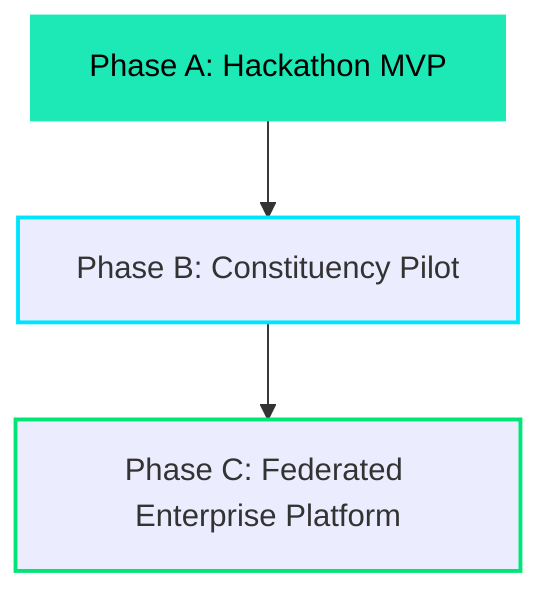

# HELIX-SPEC-002: The Mission of Helix

This document outlines the current operational purpose, execution strategy, scope boundaries, and evolution roadmap for Helix. While the Vision defines the future state of governance, this Mission document specifies *what* we are building today to bring that future into reality.

---

## 1. Executive Summary
Helix is building an open-source, event-driven, AI-native Governance Operating System that standardizes and accelerates citizen-to-government interaction. Today, public offices are bottlenecked by unstructured inbound messages and manual classification cycles. Helix provides the orchestrating infrastructure that ingests, translates, categorizes, prioritizes, and drafts resolutions for community issues—maintaining strict human authority and policy-backed evidence at every step.

---

## 2. Core Mission
To build and deploy a modular, secure, and localization-ready software platform that reduces constituency administrative overhead, decreases issue resolution latency, and structures institutional memory, enabling democratic offices to serve their communities with maximum transparency and efficiency.

---

## 3. Stakeholders

| Stakeholder Group | Primary Goal | Value Offered by Helix |
| :--- | :--- | :--- |
| **Citizens** | Submit issues simply, track progress, receive fast answers. | Zero-friction channel integration (WhatsApp), native language interaction, transparent status updates. |
| **Constituency Representatives (MPs/MLAs)** | Understand community needs, allocate budgets, track project delivery. | Analytical dashboard showing issue heatmaps, trending grievances, and project fulfillment metrics. |
| **Administrative Officers (Collectors/Commissioners)** | Triage inbound workloads, assign tasks, optimize workflows. | AI-assisted ticket categorization, auto-matching with active policy and personnel, automated resolution drafts. |
| **Field Engineers / Operators** | Receive clear work assignments, report resolution status. | Structured work orders with geo-coordinates, photos, and historical ticket logs. |
| **Platform Contributors / Integrators** | Extend system functionality for new channels, regions, or AI models. | Clean SDK boundaries and plugin interfaces allowing swift local customizations. |

---

## 4. Product Objectives

* **Ingestion Simplification:** Enable issue submission via WhatsApp, SMS, and voice notes with automatic language-to-text translation.
* **Administrative Acceleration:** Automate duplicate detection, ticket classification, and policy document retrieval to assist operators during triage.
* **Orchestration & Workflow:** Provide a robust, event-driven ticketing pipeline that manages issues from ingestion through assignment, verification, and resolution.
* **Explainable Resolution Drafting:** Auto-generate response drafts for officers that cite the exact policy clauses or local resources used.
* **Knowledge Consolidation:** Build a dynamic knowledge graph tracking relationships between citizens, issues, assets, and resolutions.

---

## 5. Success Criteria

* **Response Efficiency:** Reduce the average administrative response times to community queries from weeks to less than 48 hours.
* **Triage Automation Accuracy:** Achieve a classification accuracy score above **90%** for automated sorting of inbound issues.
* **Stakeholder Adoption:** Secure active usage of the administrative dashboard by at least one partner constituency office during the pilot.
* **Self-Hosting Time:** Ensure that a new development environment or production cloud instance can be spun up using our configuration templates in under **30 minutes**.

---

## 6. Scope (Current Milestone)

* **Multichannel Intake:** Integrations with WhatsApp Business API and custom web forms for issue submissions.
* **Ingestion Pipeline:** Automatic speech-to-text translation for regional audio inputs, and language detection (transliterated text parsing).
* **Operator Interface:** A web-based administrative console for issue triage, mapping, task assignment, and response approval.
* **RAG-Driven Recommendation Engine:** Contextual policy search that drafts responses and links them to uploaded local policy datasets.
* **Constituency Database:** Standard schemas for citizens, issues, assets, and project states.
* **Audit Trail:** Persistent event logs showing who approved an action and what evidence supported it.

---

## 7. Non-Scope (Deliberately Excluded from Current Focus)

* **Direct Automated Outbound Posting:** No automated messaging is sent directly to citizens without prior administrative approval.
* **Financial Transaction / Payment Engine:** Helix does not handle budget transfers, tax collection, or vendor payments directly.
* **Biometric Authentication:** Citizen verification is tied to phone numbers or email addresses; biometric verification (e.g. Aadhaar) is out of scope for the MVP.
* **Autonomous Resource Dispatch:** The system will not automatically assign third-party contract work or spend municipal budgets.
* **Real-time Online Model Training:** LLM tuning is conducted offline; no online adaptation of model weights is performed to prevent poison attacks.

---

## 8. Guiding Principles

* **Integrity of Context:** Prioritize safety and grounding over fluent speculation. If evidence is lacking, report it.
* **Strict Human Veto:** The system is an advisor. Every action requires human review, validation, and cryptographic signature before execution.
* **Zero Platform Lock-In:** Build on open standards to ensure the platform can run on-premise or across any cloud provider.
* **Accessibility Over Complexity:** Code interfaces and user workflows must target accessibility standards from day one.

---

## 9. Evolution Strategy

### 9.1. Phase A: Hackathon MVP
* **Focus:** Build core event bus, WhatsApp ingestion, basic operator triage UI, and local RAG recommendations.
* **Target:** Deployable single-instance backend running on Google Cloud with mock datasets.

### 9.2. Phase B: Constituency Pilot
* **Focus:** Integration with official constituency communication channels, loading real policy documents, and training operators.
* **Target:** Active deployment in one constituency or local administrative office to handle live community issues under strict human review.

### 9.3. Phase C: Federated Enterprise Platform
* **Focus:** Introduce multi-tenant scaling, federated synchronization between offices, advanced security hardening, and on-premise offline hosting.
* **Target:** Reusable open-source platform deployable across states and countries.

---

## 10. Design Validation Checklist

* [ ] **Charter Alignment:** Aligns with the foundational principles defined in `HELIX-SPEC-000`.
* [ ] **Constitution Alignment:** Conforms to all Twelve Laws of the Helix Constitution.
* [ ] **Measurable Objectives:** Defines clear success criteria (latency, accuracy, adoption, setup speed).
* [ ] **Stakeholder Mapping:** Explicitly lists primary actors and values offered.
* [ ] **Scope Separation:** Explicitly outlines current scope and out-of-scope boundaries.
* [ ] **No Tech Specifications:** Focuses on *what* is being built rather than *how* it is coded.
* [ ] **Evolution Model:** Outlines stages from hackathon to enterprise release.
* [ ] **Checklist Compliance:** Ends with this validation gate.
