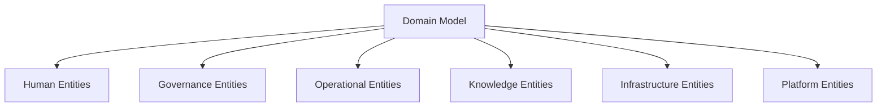
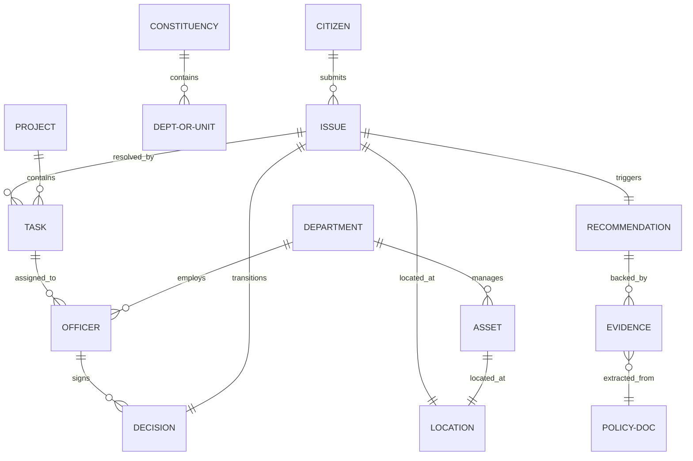

# HELIX-DOMAIN-001: Governance Domain Model

This specification establishes the Ubiquitous Language and logical domain entities of Helix. It defines the business vocabulary, lifecycle transitions, and conceptual relationships that all developers, database schemas, APIs, AI agents, and plugin SDKs must utilize consistently.

---

## 1. Executive Summary
Public governance models suffer from inconsistent naming, overlapping entity boundaries, and fragmented structural context. In a single municipality, the terms "grievance," "ticket," "complaint," and "issue" are often used interchangeably, leading to semantic drift and fragile system integrations. Helix enforces Domain-Driven Design (DDD) to establish a clean boundary for civic data.

The Governance Domain Model defines the business entities of the public administration space. It stays completely independent of technology concerns, providing the single, authoritative framework for modeling data and system states in Helix.

---

## 2. Domain Design Principles

* **Ubiquity of Terms:** Every term in the domain has one, and only one, meaning. Developers must write code using these exact entities; database fields and code classes must map directly to these domain names.
* **Separation of Roles:** Human roles are modeled as distinct, isolated entities. A `Citizen` submitting an issue is structurally separate from an `Officer` triaging it, even if they share baseline contact parameters.
* **Strict State Integrity:** Operational entities (e.g. `Issue`, `Project`) can only transition states through explicit lifecycle events driven by authenticated `Decisions`. Direct, unstructured state modification is prohibited.
* **Evidence Grounding:** Every `Recommendation` generated by the platform must link to one or more `Evidence` records derived from `Policy Documents`. Speculative categorization without evidence violates the domain boundary.

---

## 3. Entity Categories

To organize the domain vocabulary, entities are divided into six logical categories:

1. **Human Entities:** Actors that trigger events, approve transactions, or submit grievances within the system.
2. **Governance Entities:** Structural definitions of administrative boundaries, legal frameworks, and local departments.
3. **Operational Entities:** Dynamic transactional records tracking requests, tasks, and system notifications.
4. **Knowledge Entities:** Grounding facts, references, and proposed drafts that guide decision-making.
5. **Infrastructure Entities:** Physical or geographic entities managed by the public office.
6. **Platform Entities:** Technical connectors and integrations extending the system's capabilities.

---

## 4. Entity Definitions

### 4.1. Human Entities

#### DOM-001: Citizen
* **Definition:** A public resident, community member, or local voter who interacts with the governance platform.
* **Purpose:** Acts as the primary client of public services, submitting issues and receiving resolution feedback.
* **Lifecycle:** `Active` (can submit issues) $\rightarrow$ `Deactivated` (opted out or blocked).
* **Relationships:** Submits `Issues` (1:N), is notified by `Notifications` (1:N).
* **Ownership:** Owned by the Constituency.
* **Example:** "A resident named Harsh submitting a report about a broken street light."

#### DOM-002: Officer
* **Definition:** A designated administrative employee, field worker, or departmental engineer working for the public office.
* **Purpose:** Receives, triages, routes, resolves, or verifies operational issues.
* **Lifecycle:** `Provisioned` $\rightarrow$ `Active` $\rightarrow$ `Suspended`.
* **Relationships:** Belongs to a `Department` (N:1), executes `Tasks` (1:N), makes `Decisions` (1:N).
* **Ownership:** Owned by the Department.
* **Example:** "A junior engineer assigned to repair water pumps."

#### DOM-003: Representative (MP/MLA/Councillor)
* **Definition:** An elected or appointed political leader representing a designated constituency or municipality.
* **Purpose:** Oversees constituency-wide metrics, creates projects, and guides local welfare distributions.
* **Lifecycle:** `In-Office` $\rightarrow$ `Term-Ended` $\rightarrow$ `Inactive`.
* **Relationships:** Owns a `Constituency` (1:1), initiates `Projects` (1:N), monitors `Outcomes` (1:N).
* **Ownership:** Owned by the Constituency.
* **Example:** "The Member of Parliament overseeing regional infrastructure allocations."

---

### 4.2. Governance Entities

#### DOM-004: Constituency
* **Definition:** The highest structural tier of political and geographical representation managed in the system.
* **Purpose:** Grouping parameter for all child administrative units, assets, and departments.
* **Lifecycle:** `Active` $\rightarrow$ `Re-Districted`.
* **Relationships:** Contains `Administrative Units` (1:N), contains `Departments` (1:N).
* **Ownership:** Owned by the Representative.
* **Example:** "New Delhi Parliamentary Constituency."

#### DOM-005: Administrative Unit
* **Definition:** A localized geographic partition under the constituency (e.g. Ward, Panchayat, Block).
* **Purpose:** Categorizes issues, assets, and projects by precise administrative boundaries.
* **Lifecycle:** `Active` $\rightarrow$ `Modified`.
* **Relationships:** Belongs to a `Constituency` (N:1), contains `Assets` (1:N), maps to `Locations` (1:1).
* **Ownership:** Owned by the Constituency.
* **Example:** "Panchayat No. 12 (Village Mandi)."

#### DOM-006: Department
* **Definition:** An administrative department or corporate entity responsible for public services (e.g., Water Board, Sanitation Department).
* **Purpose:** Executes triaged tasks and maintains specific civic infrastructure.
* **Lifecycle:** `Active` $\rightarrow$ `Merged` $\rightarrow$ `Archived`.
* **Relationships:** Employs `Officers` (1:N), manages `Assets` (1:N), executes `Tasks` (1:N), owns `Schemes` (1:N).
* **Ownership:** Owned by the Constituency.
* **Example:** "Municipal Sanitation Division."

#### DOM-007: Scheme
* **Definition:** A government program, welfare package, or structured citizen benefit service (e.g., Pension Scheme).
* **Purpose:** Defines the rules, qualifying metrics, and assets allocated for specific community benefits.
* **Lifecycle:** `Proposed` $\rightarrow$ `Active` $\rightarrow$ `Expired`.
* **Relationships:** Owned by a `Department` (N:1), governed by `Policy Documents` (1:N).
* **Ownership:** Owned by the Department.
* **Example:** "Old Age Pension Welfare Program."

#### DOM-008: Policy Document
* **Definition:** An official gazette, government circular, regulation file, or scheme guideline dataset.
* **Purpose:** Acts as the legal source of truth used to ground RAG retrieval and explain recommendations.
* **Lifecycle:** `Draft` $\rightarrow$ `Effective` $\rightarrow$ `Superseded`.
* **Relationships:** Governs a `Scheme` (N:1), yields `Evidence` (1:N).
* **Ownership:** Owned by the Department.
* **Example:** "Water Conservation Act of 2025."

---

### 4.3. Operational Entities

#### DOM-009: Issue
* **Definition:** A citizen's report, query, or application submitted to the public office.
* **Purpose:** Tracks the ingestion, triage, routing, and resolution progress of a community need.
* **Lifecycle:** `Ingested` $\rightarrow$ `Triaged` $\rightarrow$ `In-Progress` $\rightarrow$ `Resolved` $\rightarrow$ `Closed`.
* **Relationships:** Submitted by `Citizen` (N:1), resolved by `Tasks` (1:N), linked to `Location` (1:1).
* **Ownership:** Owned by the Ingestion Router (unassigned) $\rightarrow$ Assigned Department.
* **Example:** "Grievance regarding water contamination in Ward 4."

#### DOM-010: Task
* **Definition:** A granular work order assigned to an officer or department to resolve a specific issue.
* **Purpose:** Coordinates actual field repairs, investigations, or administrative validations.
* **Lifecycle:** `Created` $\rightarrow$ `Assigned` $\rightarrow$ `Completed` $\rightarrow$ `Verified`.
* **Relationships:** Part of an `Issue` (N:1), assigned to `Officer` (N:1), linked to `Assets` (N:N).
* **Ownership:** Owned by the assigned Officer.
* **Example:** "Task to replace pipeline valve #4."

#### DOM-011: Workflow
* **Definition:** The sequence of states, validation conditions, and routing rules that govern an issue or project.
* **Purpose:** Guarantees that administrative steps are executed in compliance with local rules.
* **Lifecycle:** `Inactive` $\rightarrow$ `Active` $\rightarrow$ `Deprecated`.
* **Relationships:** Governs `Issues` (1:N), executes `Tasks` (1:N).
* **Ownership:** Owned by the Department.
* **Example:** "Standard Sanitation Issue Escalation Flow."

#### DOM-012: Notification
* **Definition:** A system message dispatched to a citizen or officer containing status updates or alerts.
* **Purpose:** Keeps stakeholders informed asynchronously on their channel of choice.
* **Lifecycle:** `Queued` $\rightarrow$ `Sent` $\rightarrow$ `Delivered` $\rightarrow$ `Failed`.
* **Relationships:** Addressed to `Citizen` or `Officer` (N:1), triggered by `Workflow` (N:1).
* **Ownership:** Owned by the Dispatch Service.
* **Example:** "WhatsApp alert: 'Your water pump report is now In-Progress'."

---

### 4.4. Knowledge Entities

#### DOM-013: Evidence
* **Definition:** A factual reference, geolocation verification, or cited policy extract that supports a recommendation.
* **Purpose:** Guarantees that AI suggestions are grounded in verifiable data before presentation.
* **Lifecycle:** `Extracted` $\rightarrow$ `Verified` $\rightarrow$ `Archived`.
* **Relationships:** Extracted from `Policy Document` or `Issue` (N:1), supports `Recommendation` (N:1).
* **Ownership:** Owned by the Knowledge Registry.
* **Example:** "Section 4B of the Water Act stating clean drinking water is a basic municipal duty."

#### DOM-014: Recommendation
* **Definition:** An AI-generated triage classification, scheme match proposal, or response draft.
* **Purpose:** Proposes resolutions and drafts to administrative officers to speed up triage.
* **Lifecycle:** `Proposed` $\rightarrow$ `Accepted` $\rightarrow$ `Rejected`.
* **Relationships:** References `Issue` (1:1), supported by `Evidence` (1:N), generates `Decision` (1:1).
* **Ownership:** Owned by the AI Agent Engine.
* **Example:** "Proposed draft reply acknowledging road repair schedule."

---

### 4.5. Infrastructure Entities

#### DOM-015: Asset
* **Definition:** A physical asset or digital utility managed by the constituency (e.g. water pumps, school buildings).
* **Purpose:** Maps issues to specific objects in the physical world to tracking lifecycle costs and failures.
* **Lifecycle:** `Active` $\rightarrow$ `Maintenance` $\rightarrow$ `Decommissioned`.
* **Relationships:** Belongs to `Administrative Unit` (N:1), linked to `Tasks` (N:N), mapped to `Location` (1:1).
* **Ownership:** Owned by the managing Department.
* **Example:** "Borewell Pump #45-B."

#### DOM-016: Project
* **Definition:** An administrative program containing multiple tasks and assets, created to resolve structural issues.
* **Purpose:** Groups related tasks under a unified budget and target timeline.
* **Lifecycle:** `Planned` $\rightarrow$ `Approved` $\rightarrow$ `Active` $\rightarrow$ `Completed`.
* **Relationships:** Initiated by `Representative` (N:1), contains `Tasks` (1:N), affects `Assets` (1:N).
* **Ownership:** Owned by the Representative's Office.
* **Example:** "Ward 4 Water Purification Project."

#### DOM-017: Location
* **Definition:** The exact geospatial coordinates (latitude/longitude), address coordinates, or polygon boundaries of an issue or asset.
* **Purpose:** Pinpoints where issues occur or assets reside on administrative maps.
* **Lifecycle:** `Static`.
* **Relationships:** Maps to `Issue` (1:1), maps to `Asset` (1:1), maps to `Administrative Unit` (N:1).
* **Ownership:** Owned by the mapping system.
* **Example:** "`Lat: 28.6139, Lon: 77.2090` (New Delhi)."

---

### 4.6. Platform Entities

#### DOM-018: Plugin
* **Definition:** An isolated software extension module implementing a defined Helix system interface.
* **Purpose:** Connects Helix with external model endpoints, messaging APIs, and databases.
* **Lifecycle:** `Registered` $\rightarrow$ `Enabled` $\rightarrow$ `Disabled`.
* **Relationships:** Extends `Workflow` (N:1), processes `Notifications` (N:1).
* **Ownership:** Owned by the Platform Administrator.
* **Example:** "WhatsApp Ingestion Connector Plugin."

#### DOM-019: AI Agent
* **Definition:** An autonomous LLM-driven routine that executes specific tools under operator supervision.
* **Purpose:** Performs classifications, semantic searches, and document synthesis.
* **Lifecycle:** `Active` $\rightarrow$ `Decommissioned`.
* **Relationships:** Processes `Issues` (1:N), generates `Recommendations` (1:N).
* **Ownership:** Owned by the Platform Administrator.
* **Example:** "Sanitation Triage Agent."

#### DOM-020: Decision
* **Definition:** A cryptographically signed human approval that resolves an issue or initiates a project.
* **Purpose:** Binds system state changes to an accountable operator.
* **Lifecycle:** `Proposed` $\rightarrow$ `Signed` $\rightarrow$ `Archived`.
* **Relationships:** Authorized by `Officer` or `Representative` (N:1), transition `Issue` or `Project` state (1:1).
* **Ownership:** Owned by the signing Officer or Representative.
* **Example:** "Approved repair dispatch signature log."

#### DOM-021: Outcome
* **Definition:** The measurable real-world impact, citizen satisfaction level, or performance metric recorded for a system entity.
* **Purpose:** Tracks administrative health indexes, regional progress, and service delivery performance.
* **Lifecycle:** `Recorded` $\rightarrow$ `Verified`.
* **Relationships:** Evaluates an `Issue`, `Project`, `Scheme`, `Administrative Unit`, or `Constituency` (N:1).
* **Ownership:** Owned by the Constituency.
* **Example:** "Constituency-wide water availability score improved by 18%, or local Panchayat cleanliness index verified at 94%."

---

## 5. Relationship Overview

Below is the conceptual relationship model mapping category boundaries. This diagram shows logical associations rather than structural database foreign keys:

---

## 6. Ubiquitous Language Rules

To maintain domain consistency, every developer, designer, and writer must adhere to the following rules:

1. **Class Names and Database Tables:** Must match the **Entity Name** exactly (e.g. use class `Issue`, database table `issues`).
2. **Variable Prefixes:** Keys and identifiers must use the designated domain prefix (e.g., `issue_id`, `asset_id`, `citizen_id`).
3. **Model Descriptions:** API documentation, specifications, and inline comments must use these terms exclusively.

---

## 7. Naming Conventions

* **Issue Statuses:** Standardized to: `Ingested`, `Triaged`, `In-Progress`, `Resolved`, `Closed`. No custom states like `Pending`, `Fixed`, or `Done` are permitted.
* **Task Statuses:** Standardized to: `Created`, `Assigned`, `Completed`, `Verified`.
* **Geospatial Variables:** Must always be mapped under a unified `Location` object containing `latitude`, `longitude`, and `formatted_address`.

---

## 8. Anti-Patterns
To prevent semantic drift, these terms **must never** be used interchangeably:

* **Issue vs. Task:** An `Issue` is a citizen's request (e.g. "Water leak on Main St"). A `Task` is an internal work unit assigned to an officer to fix it (e.g. "Replace pipe seal"). An issue can have many tasks.
* **Evidence vs. Recommendation:** `Evidence` is a static fact extracted from policy documents or issue details. A `Recommendation` is an AI-generated proposal supported by that evidence.
* **Representative vs. Officer:** A `Representative` is an elected official overseeing a constituency. An `Officer` is an administrative employee executing tasks.
* **Scheme vs. Policy Document:** A `Scheme` is the welfare program itself. A `Policy Document` is the legal gazette or regulation file defining it.

---

## 9. Design Validation Checklist

* [ ] **Charter Alignment:** Directly matches the core principles defined in `HELIX-SPEC-000`.
* [ ] **Constitution Alignment:** Conforms to all Twelve Laws of the Helix Constitution.
* [ ] **DDD Compliance:** Avoids database schema definitions, technology specs, and programming structures.
* [ ] **Coded IDs:** Every domain entity has an identifier tag (`DOM-XXX`).
* [ ] **Lifecycle Traceability:** Every entity lists its lifecycle states.
* [ ] **Relationship Overview:** Includes the conceptual entity-relationship mapping diagram.
* [ ] **Anti-Patterns Defined:** Lists terms that must never be used interchangeably.
* [ ] **Checklist Compliance:** Ends with this validation gate.
