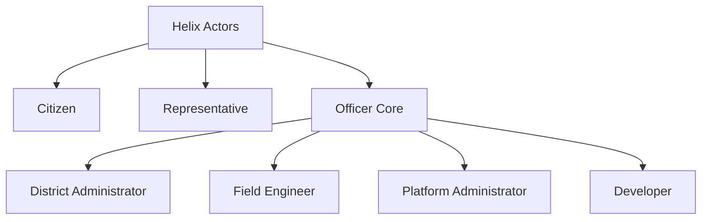

# HELIX-ARCH-001: System Context

This specification defines the logical operating boundary of Helix. It establishes the actors, external dependencies, system context boundaries, and trust levels before any internal microservice container or data schema is designed.

---

## 1. Executive Summary
Understanding system boundaries is essential to maintaining low software coupling and high security. In public sector software, a common failure mode is the structural blending of civic applications with external government databases, message brokers, and communication channels. This coupling results in systems that are brittle, hard to test locally, and prone to service cascade failures.

This document defines the system context of Helix. It establishes what Helix owns, what it integrates with, who utilizes it, and the trust boundaries separating the system from the outside world.

---

## 2. System Purpose
Helix is designed to act as an intermediary operating layer between citizens and public administrations. Its purpose is to ingest unstructured public requests, structure them into a normalized domain format, provide grounded policy references, suggest resolutions to administrative officers, and coordinate tasks to completion under strict human-in-the-loop validation.

---

## 3. Primary Actors

Helix interacts with seven distinct actors, classified by their relationship to our Domain Model (`HELIX-DOMAIN-001`):



### 3.1. Citizen (DOM-001)
* **Responsibilities:** Submits reports on localized problems (e.g. broken pumps, public utility failures) or applies for welfare schemes.
* **Goals:** Quick intake verification, transparent tracking of issue progress, and successful resolution.
* **Interaction with Helix:** Interacts exclusively through consumer messaging channels (SMS, WhatsApp, web portal) without directly accessing internal administrative dashboards.

### 3.2. Representative (DOM-003)
* **Responsibilities:** Oversees constituency-wide progress, reviews performance metrics, and initiates development projects.
* **Goals:** High citizen satisfaction scores, efficient resolution of municipal bottlenecks, and clear constituency impact logs.
* **Interaction with Helix:** Views read-only, high-level dashboards compiling outcomes, issue statistics, and active project timelines.

### 3.3. Officer (DOM-002) - Core Triage
* **Responsibilities:** Reviews incoming classified reports, accepts or edits response drafts, and assigns task orders to departments.
* **Goals:** Rapid issue triaging, accurate policy alignment, and reliable departmental routing.
* **Interaction with Helix:** Interacts with the main administrative workstation web console, utilizing keyboard-driven actions.

### 3.4. Field Engineer (DOM-002) - Resolution Actor
* **Responsibilities:** Receives tasks assigned by officers, performs physical repairs or site inspections, and uploads evidence of work.
* **Goals:** Clear task definitions, quick access to asset location logs, and fast verification updates.
* **Interaction with Helix:** Accesses mobile-optimized task queues, updating task statuses and uploading completion logs.

### 3.5. District Administrator (DOM-002) - Management Actor
* **Responsibilities:** Configures local priority parameters, manages officer assignment mappings, and updates local policy documents.
* **Goals:** Policy compliance, efficient load balancing across teams, and clean configuration updates.
* **Interaction with Helix:** Modifies system configuration files and uploads updated circulars into the policy document store.

### 3.6. Platform Administrator (DOM-002) - Operations Actor
* **Responsibilities:** Manages platform configuration, deployments, secrets, monitoring and plugin lifecycle.
* **Goals:** System uptime, security compliance, and clean integration changes.
* **Interaction with Helix:** Manages deployments, registers plugin DLLs/classes, and monitors logging metrics.

### 3.7. Developer (DOM-002) - Extension Actor
* **Responsibilities:** Builds custom plugins, extends ingestion channels, and tests new model configurations.
* **Goals:** Clean SDK contracts, isolated mock testing environments, and simple plugin deployment paths.
* **Interaction with Helix:** Consumes system API contracts and implements interfaces defined in the Plugin SDK.

---

## 4. External Systems
Helix communicates with several external systems to ingest messages, fetch metadata, and dispatch updates.

| System Name | Purpose | Data Direction | Trust Level |
| :--- | :--- | :---: | :---: |
| **WhatsApp Business API** | Ingests incoming citizen text/images; dispatches status notifications. | Bidirectional | Untrusted |
| **SMS Gateway** | Backup channel for text ingestion and notification updates. | Bidirectional | Untrusted |
| **Email Gateway** | Ingestion channel for complex documents; dispatches officer report digests. | Bidirectional | Untrusted |
| **Government Open Data** | Fetches public department metrics, budget records, and project lists. | Read-Only | Semi-Trusted |
| **Government GIS / Asset Registry** | Existing government asset database (roads, schools, hospitals, water pipelines, etc.) | Read-Only | Semi-Trusted |
| **Census/Demographics** | Resolves address coordinates or verifies eligibility data. | Read-Only | Semi-Trusted |
| **GIS/Mapping Service** | Resolves geospatial coordinates (latitude/longitude) to address boundaries. | Bidirectional | Semi-Trusted |
| **Weather API** | Fetches climate status records to evaluate and rank issue priority levels. | Read-Only | Untrusted |
| **Satellite Imagery** | Imports physical imagery layers to verify land and project progress. | Read-Only | Semi-Trusted |
| **Circular Repositories** | Scrapes official municipal gazettes and policy circular updates. | Read-Only | Semi-Trusted |
| **Notification Dispatch** | Third-party push providers (e.g. Firebase, APNS) for mobile devices. | Write-Only | Untrusted |

---

## 5. Internal System Boundary
The internal system boundary defines everything that Helix owns, manages, and executes within its runtime:
* **Ingestion Queues:** Decouples incoming payloads from downstream processing pipelines.
* **Triage Classifier:** Parses unstructured inputs to extract locations, categories, and priority metrics.
* **Policy RAG Processor:** Queries local policy embeddings to fetch grounding facts.
* **Recommendation Engine:** Synthesizes RAG contexts to draft responses and actions.
* **Workflow Orchestrator:** Manages state changes for Issues, Tasks, and Projects.
* **Decision Verification Ledger:** Log of cryptographically signed human approvals.
* **Knowledge Graph Sync:** Syncs transactional tables with our persistent constituency history store.

---

## 6. External Boundary
Helix explicitly excludes the following concerns from its system boundary:
* **Physical Carrier Networks:** Telecommunication routes, cell towers, and data carriers.
* **Third-Party Model Weights:** Hosting and training of LLM models (managed via standardized plugin APIs).
* **Payment/Financial systems:** Actual budget distributions or accounting ledgers (Helix only models proposed budgets).
* **Government Identity Providers (IdP):** Citizen national IDs, administrative Active Directory instances (Helix delegates to external OAuth/SAML tokens).
* **Local Broker/Database Hosts:** The physical hardware hosting the databases or event buses (Helix only owns the application connection client configurations).
* **Existing Government ERPs:** Existing corporate software platforms and financial/human resources records databases. Helix integrates with these systems but never replaces them.

---

## 7. Trust Boundaries
Helix partitions its operations into three distinct trust zones:

```text
    [ PUBLIC ZONE ]              [ GOVERNMENT ZONE ]            [ INTERNAL PLATFORM ZONE ]
  Citizen Ingestion Channels  ──►  Officer Web Consoles  ──►  Event Message Buses & DBs
     (Fully Untrusted)            (Semi-Trusted Auth)              (Fully Trusted Virtual Net)
```

### 7.1. Public Zone (Untrusted)
* **Components:** WhatsApp API endpoints, SMS ingest lines, citizen Web portals.
* **Rules:** All input payloads must be sanitized. PII scanning filters run at this boundary before data is forwarded. No direct database access is allowed from this zone.

### 7.2. Government Zone (Semi-Trusted)
* **Components:** Administrative dashboards, officer web consoles, field task queues.
* **Rules:** Access requires valid identity tokens. All administrative changes must include a cryptographic signature log.

### 7.3. Internal Platform Zone (Trusted)
* **Components:** Core workflow engines, RAG databases, event buses, configuration registers.
* **Rules:** Restricted to internal service call routes on virtual private networks. No direct external incoming paths are allowed.

---

## 8. High-Level Interaction Flows

### 8.1. Citizen Report Ingestion
1. Citizen sends a WhatsApp photo detailing a broken water pipe.
2. WhatsApp Plugin forwards raw payload to the Public Zone.
3. Ingest filter masks citizen PII, publishes `IssueIngested` event.
4. Triage classifier parses text/photo metadata to categorize and locate the issue.

### 8.2. Recommendation and Triage Verification
1. Classification engine queries RAG database for local water policy constraints.
2. AI Agent generates a recommended task order and response draft.
3. System assigns the recommendations to the Officer's dashboard.
4. Officer reviews, edits, and signs off.
5. Helix publishes `IssueTriaged` event, triggering the creation of a field task.

---

## 9. Context Principles
All external integrations must obey these context principles:
* **CTX-P-001: Contract Isolation:** External API integrations must use adapter wrappers. No service may consume third-party API models directly.
* **CTX-P-002: Ingress Sanitization:** All ingress streams must pass schema verification before entering queue buffers.
* **CTX-P-003: Rate Limiting & Backpressure:** Ingestion endpoints must rate-limit incoming requests to prevent DDoS conditions.
* **CTX-P-004: Fail-Safe Integrations:** If an external system (e.g. Census API) fails, Helix must continue running, defaulting to a manual verify state.

---

## 10. Design Validation Checklist

* [ ] **Charter Alignment:** Directly matches the core principles defined in `HELIX-SPEC-000`.
* [ ] **Constitution Alignment:** Conforms to all Twelve Laws of the Helix Constitution.
* [ ] **DDD Compliance:** Uses actors and domain concepts in alignment with `HELIX-DOMAIN-001`.
* [ ] **Coded IDs:** Actor definitions, external system parameters, and context principles have clear IDs.
* [ ] **Trust Boundaries defined:** Clearly partitions Public, Government, and Platform zones.
* [ ] **No Tech Specifications:** Avoids referencing databases, programming languages, and host platforms.
* [ ] **Checklist Compliance:** Ends with this validation gate.
