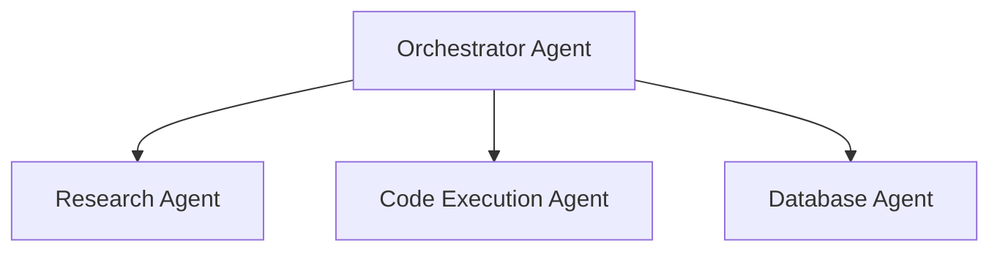

# AI System Design

This page outlines the AI engine, agent architecture, evaluation metrics, and guardrails.

> [!NOTE]
> System evaluations, hallucination testing, and prompt engineering logic will be engineered during **Phase 4: AI Engineering**.

## Agent Architecture

Helix AI utilizes a modular agent pattern where agents have specialized roles:

## Guardrails & Moderation

- **Prompt Security:** Mitigation techniques against prompt injection.
- **Output Validation:** Automated type-checks and parsing filters (e.g. JSON schema validators).
- **Hallucination Evaluation:** Structured verification processes.
