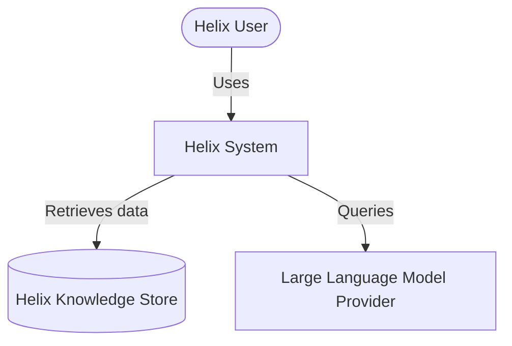

# Architecture Overview

This page serves as the entry point for the architectural designs of Project Helix.

> [!NOTE]
> System design, microservices division, and microservices contracts will be finalized in **Phase 2: Architecture**.

## Architectural Decisions

All architectural decisions are formally documented using **Architecture Decision Records (ADRs)** located in [adr/](file:///home/harsh/Desktop/CodeNova/Helix/adr/).

### ADR Catalog

| ADR ID | Title | Status | Date |
| :--- | :--- | :--- | :--- |
| `ADR-001` | _(Placeholder for first ADR)_ | Proposed | 2026-07-05 |

## C4 Model

We use the C4 Model format (Context, Containers, Components, Code) to document the software architecture.

### Level 1: System Context Diagram

