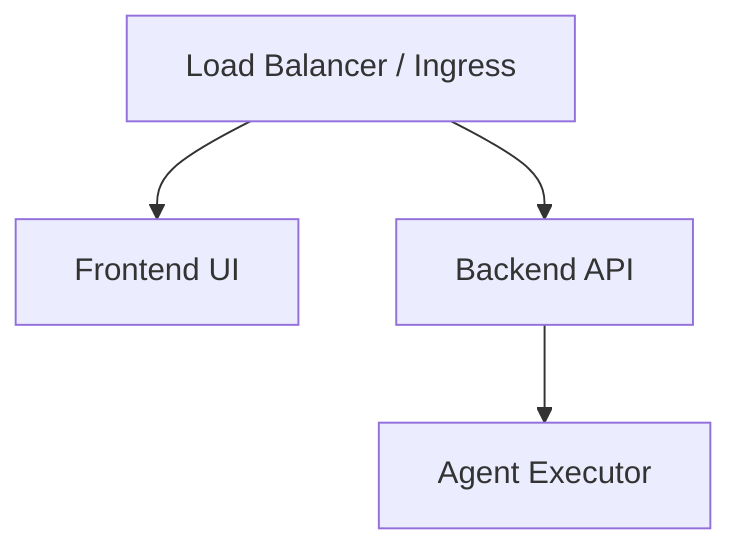

# Deployment Architecture

This document describes how to deploy Helix to production environments.

> [!NOTE]
> Active scripts for production deployment will be validated in **Phase 8: Pilot Deployment**.

## Cloud Topology

We target deployments to Cloud Run or GKE (Google Kubernetes Engine).

