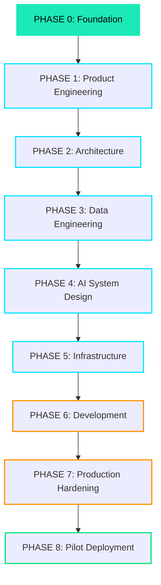

# Welcome to the Helix Engineering Portal

This is the central knowledge base, specification store, and architectural hub for **Project Helix**.

> **"We are NOT going to vibe code Helix. We are going to engineer Helix."**

Helix is built with strict engineering discipline. Our implementation is driven entirely by specifications, architecture diagrams, and design documents that are frozen before code is written.

---

## The Helix Development Lifecycle

### Development Principles

1. **Every commit has a reason.** Keep git history clean and clear.
2. **Every document has an owner.** Changes must go through the document owner and code review.
3. **Every service has a contract.** Explicit API schemas and interfaces are defined beforehand.
4. **No direct AI-generated commits.** All artifacts (code or document) must undergo:
   $$\text{Generate} \rightarrow \text{Review} \rightarrow \text{Refine} \rightarrow \text{Approve} \rightarrow \text{Commit}$$
