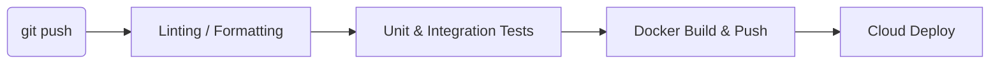

# Infrastructure Overview

This document specifies the DevOps pipeline, cloud resources, container orchestration, and continuous integration/continuous deployment (CI/CD) pipelines.

> [!NOTE]
> Detailed deployment, Terraform scripts, Kubernetes manifests, and IAM configurations will be set up during **Phase 5: Infrastructure**.

## CI/CD Pipeline

The project uses GitHub Actions for continuous integration.

## Cloud Environments

- **Development:** Locally served / Local Kubernetes.
- **Staging:** Isolated environment mirroring production.
- **Production:** High availability, multi-region.
