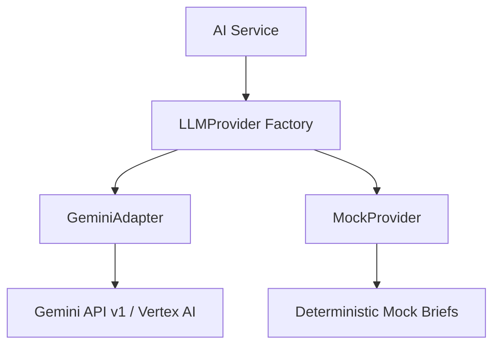

# AI Platform & Agentic Copilot Integration

Helix features a multi-agent decision pipeline, proactive analytics briefing engine, and interactive officer copilots powered by Gemini large language models.

## Architectural Design: Provider Agnostic LLM

All AI tasks consume language models through a standard factory wrapper (`LLMProvider`), allowing hot-swapping between development/offline testing engines and production cloud adapters.



### Supported Providers
* **`gemini` (Gemini API):** Invokes live Google Gemini models (e.g. `gemini-1.5-flash` or `gemini-1.5-pro`) using Vertex AI/Google Cloud API Keys.
* **`mock` (Offline Sandbox):** Returns deterministic, structured local mock justifications, enabling fully offline UI development and high-speed CI execution.

---

## The AI Decision Pipeline (Multi-Agent Workflow)

When a citizen submits a validated issue, the system automatically triggers a sequential multi-agent evaluation pipeline to output a comprehensive Officer Decision Brief.

1. **Intake Agent:** Audits evidence, validates required metadata flags, and handles compliance checks.
2. **Classification Agent:** Categorizes the issue domain (e.g., sanitation vs. roads) and maps priority urgency guidelines.
3. **Duplicate Agent:** Performs semantic search against existing active tickets to identify duplicates.
4. **Context Agent:** Scans nearby municipal assets (schools, hospitals, parks) to evaluate proximity risks.
5. **Policy Agent:** Correlates the ticket with regional subsidies, bylaws, and government schemes.
6. **Impact Agent:** Combines citizen counts and proximity scores to forecast community impact.
7. **Recommendation Agent:** Compares resolution alternatives (Accelerated, Outsource, Defer) in a structured matrix.

---

## Safety Guardrails & grounding

To guarantee governance safety, every input query and LLM generated output is run through a three-tiered safety guard before execution:

* **Toxicity Filter:** Prevents inappropriate user-submitted content.
* **PII Redaction:** Checks for emails, phone numbers, and identifying details to protect citizen privacy.
* **Grounding Validator:** Evaluates output metrics against policies to prevent model hallucinations.

---

## Environment Variables

Configure LLM settings using these parameters in `.env`:

```env
# AI Platform Configuration
LLM_PROVIDER=mock
LLM_MODEL=gemini-1.5-flash
GEMINI_API_KEY=
LLM_TIMEOUT=30
LLM_TEMPERATURE=0.2
```
