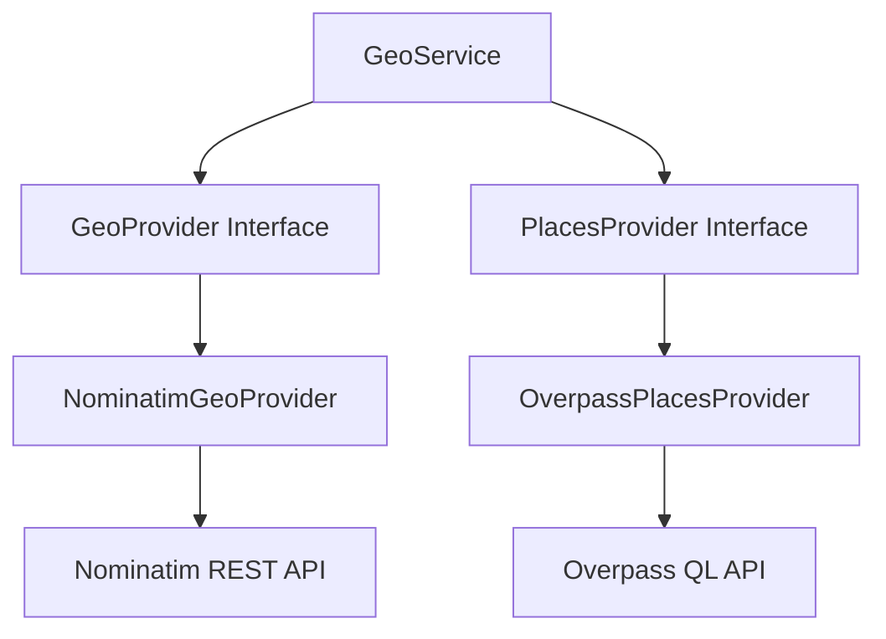

# GIS & Geo-Intelligence Platform Integration (Provider-Agnostic)

Helix integrates a WebGL-based Geo-Intelligence and GIS mapping console to evaluate citizen complaint coordinates, track regional hot-spot densities, outline administrative ward boundaries, and inspect nearby civic resources.

## Architectural Decision: MapLibre GL JS & OpenStreetMap

During Sprint 10, the mapping subsystem was migrated from the Google Maps JavaScript API to **MapLibre GL JS** + **OpenStreetMap** (Nominatim & Overpass QL).

### Rationale
* **Zero Cost & No Quotas:** Public mapping engines (like Nominatim and Overpass) do not require developer API keys, billing verification, or quota contracts, preventing unexpected downtime during demo runs.
* **Modern Vector/Raster Performance:** MapLibre GL JS renders vector overlays, ward boundary polygons, heatmaps, and marker clusters natively inside WebGL canvas contexts, delivering fluid interactivity.
* **Extensible & Provider-Agnostic:** Business logic communicates strictly through abstraction interfaces, meaning developers can swap OpenStreetMap with Mapbox, Stadia Maps, or Google Maps via config switches.

---

## Backend Provider Decoupling

The backend spatial microservice exposes address geocoding, reverse-geocoding, and proximity lookups without hardcoding external vendor details.



### 1. Geocoder Interface (`GeoProvider`)
* **OSM Implementation:** `NominatimGeoProvider`
* **Service URL:** Configurable via `GEOCODER_BASE_URL` (defaults to Nominatim OSM public server).
* **Policy Compliance:** Nominatim requires a descriptive `User-Agent` header (Helix appends a custom header: `Helix-Governance-Platform/1.0.0 (contact@helix.gov)`).

### 2. Places Interface (`PlacesProvider`)
* **OSM Implementation:** `OverpassPlacesProvider`
* **Service URL:** Configurable via `PLACES_BASE_URL` (defaults to Overpass API interpreter).
* **Query Mechanism:** Executes Overpass QL queries to find node coordinates matching target amenity selectors within radius bounding boxes.

---

## Production Reliability Heuristics

To ensure high availability and speed during regional usage, the following patterns are integrated into the spatial engine:

### 1. Size-Limited In-Memory TTL Caching
To respect public API usage rules and prevent memory leaks, geocoding coordinates are cached for **10 minutes** and nearby assets queries are cached for **5 minutes** (up to a maximum of **1000 entries** per cache, evicting the oldest key if exceeded) using a size-limited cache class (`SimpleTTLCache`).

### 2. Request Timeout & Status-Aware Exponential Backoff
All requests to external services have strict timeouts (Geocoding: **3.0 seconds**, Places: **4.0 seconds**). The engine retries requests (once, with exponential backoff) **only** on transient connection errors, timeouts, rate limits (HTTP 429), or server errors (HTTP 500, 502, 503, 504). It immediately fails without retry on client errors (HTTP 400, 401, 403, 404).

### 3. Elegant Offline Fallbacks
If both request attempts fail or the backend runs completely offline without internet connectivity, the providers automatically fall back to serving localized, high-fidelity mock data datasets (Shivaji Nagar / Sector 4 region). The frontend is 100% demo-proof.

---

## Environment Variables

Configure mapping and georeference layers using these environment keys inside `.env`:

```env
# Spatial Geo-Intelligence Platform Config
MAP_PROVIDER=osm
GEOCODER_PROVIDER=nominatim
GEOCODER_BASE_URL=https://nominatim.openstreetmap.org
PLACES_PROVIDER=overpass
PLACES_BASE_URL=https://overpass-api.de/api/interpreter
```

---

## Known Limitations & Placeholders

> [!WARNING]
> **Mocked Ward Boundaries:** The polygon rings used by `SpatialIndex` to represent Ward 12 and Bangalore Central boundaries are static coordinates. For production systems, these should be populated dynamically by loading GeoJSON or Shapefiles representing official municipal boundaries.
