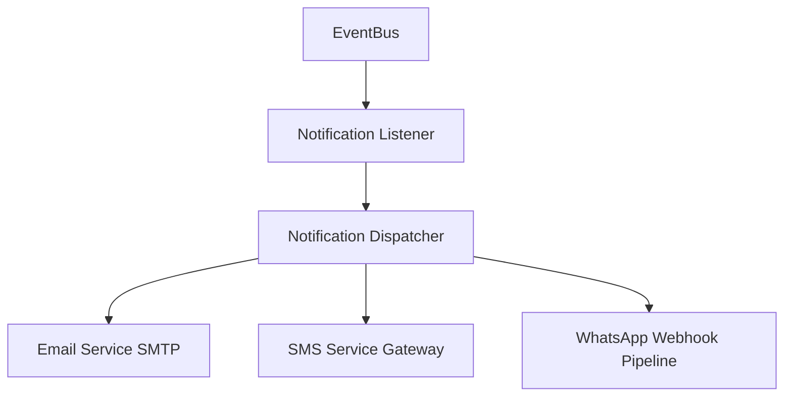

# Notification & Alert Dispatch Integration

Helix manages dynamic communications with citizens and municipal departments to provide real-time status updates and department assignment alerts.

## Architectural Design: Event-Driven Alerts

All communication services hook into the core platform `EventBus`. When state-machine changes occur (e.g. `IssueIngestedEvent`, `RecommendationAcceptedEvent`), notification listeners intercept the events and queue outgoing messages.



---

## Supported Notification Channels

### 1. SMTP Email Service
* **Audience:** Internal department managers and city officers.
* **Heuristics:** Sends full PDF summary briefs of assigned projects, estimated budgets, and regulatory codes.

### 2. SMS Alert Gateway
* **Audience:** Citizens submitting complaints.
* **Heuristics:** Dispatches high-priority text alerts when complaints transition from `INTAKE` to `TRIAGED` or `ASSIGNED`, providing tracking IDs and SLAs.

### 3. WhatsApp Messaging webhook
* **Audience:** Citizens and field workers.
* **Heuristics:** Provides interactive chat-based status queries and allows officers to submit progress pictures directly from the field.

---

## Environment Variables

Configure notification dispatch channels using these settings in `.env`:

```env
# Notification Configurations
SMTP_HOST=smtp.gmail.com
SMTP_PORT=587
SMTP_USERNAME=
SMTP_PASSWORD=
SENDER_EMAIL=noreply@helix.gov
```
