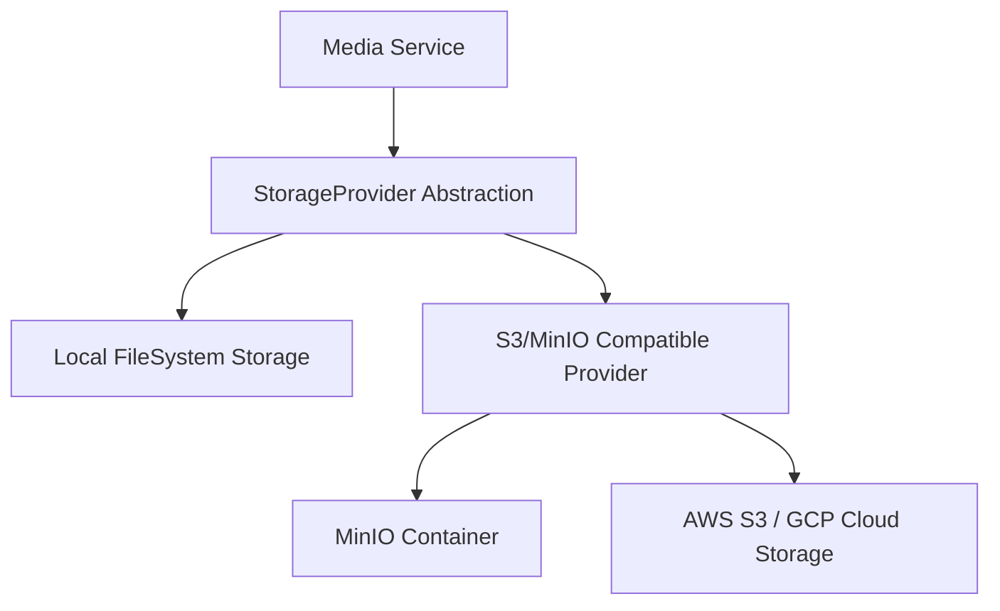

# Object & Media Storage Integration

Helix aggregates evidence attachments (photos, videos, files) uploaded during citizen reports to validate complaints and verify outcomes.

## Architectural Design: Unified File Storage

Media upload tasks route through a standard repository layer, supporting local file system storage for zero-dependency local runs, or standard S3/MinIO endpoints for production environments.



---

## Storage Modes

### 1. Local Storage (Default sandbox mode)
* **Storage Location:** Saves files directly under local workspace subdirectory (e.g. `backend/shared/storage/`).
* **Use Case:** Zero-dependency offline hackathon sandboxes.

### 2. S3-Compatible Storage
* **Storage Location:** Uploads files to S3/MinIO buckets.
* **Use Case:** Production scaling and containerized deployments.

---

## Environment Variables

Configure media storage endpoints inside `.env`:

```env
# Object Storage Configuration
STORAGE_MODE=local
# MINIO_ENDPOINT=http://localhost:9000
# S3_BUCKET=helix-assets
# S3_ACCESS_KEY=
# S3_SECRET_KEY=
```
