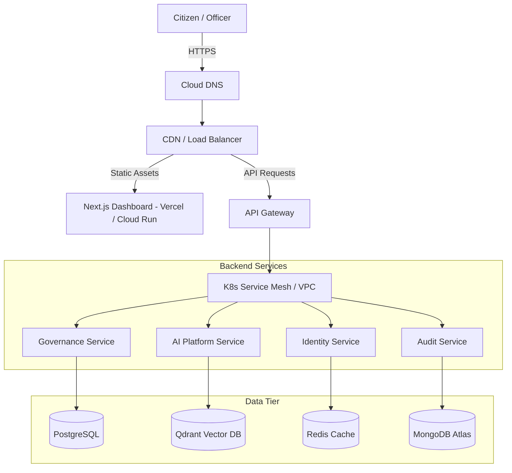

# Production Deployment Specification

This document details the production deployment architecture, deployment pipelines, and environment setups for the Helix platform.

## Infrastructure Topology

## Continuous Deployment CI/CD (GitHub Actions)

Upon merging changes into the `main` branch, the deployment flow executes automatically:

1. **Verification & Tests:**
   * Run strict PEP-8 / Ruff python linting checks.
   * Execute unit and integration tests for backend, frontend, and AI platform.
2. **Container Build & Push:**
   * Build multi-stage optimized production Docker images.
   * Tag and push images to Google Artifact Registry.
3. **Deployment Deploy:**
   * Deploy container images to Google Cloud Run (or GKE).
   * Perform post-deployment HTTP health checks on `/health/ready` liveness endpoints.
4. **Auto-Rollback Trigger:**
   * If health checks fail or error rates exceed 1% within the first 5 minutes, automatically trigger rollback to the previous stable image tag.

## Configuration & Secrets Management
* **Never commit secrets to code repository.**
* Production configurations are injected at runtime via Environment Variables into Cloud Run / GKE containers.
* Secrets are retrieved at container startup from **Google Secret Manager** (e.g. `DATABASE_URL`, `JWT_SECRET_KEY`, `GEMINI_API_KEY`).
